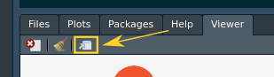
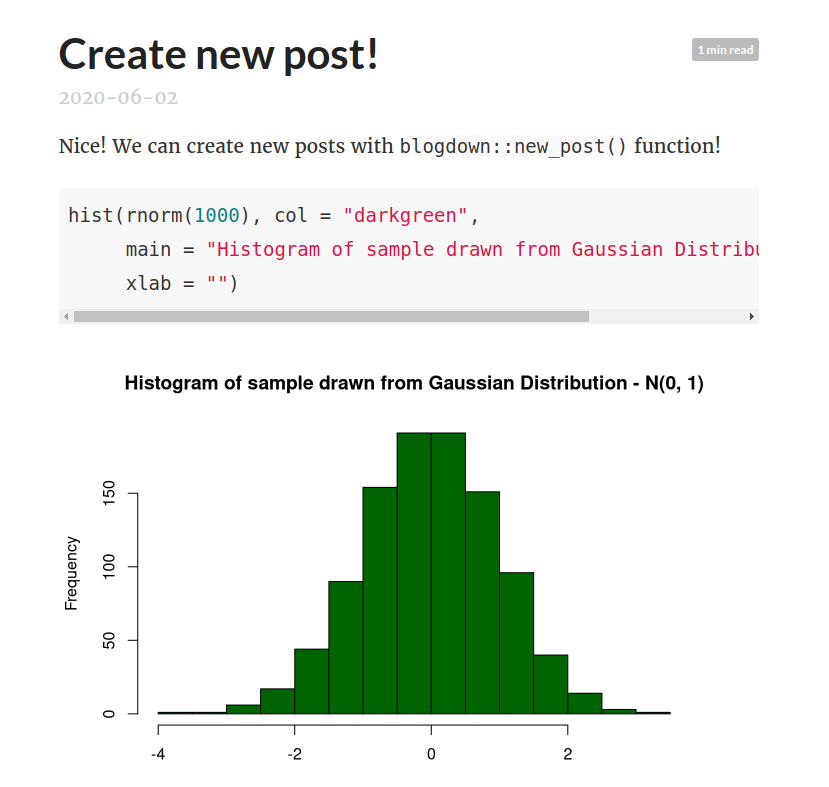
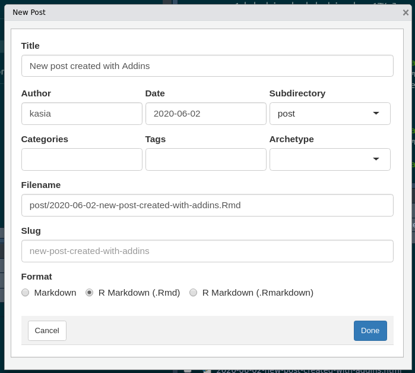
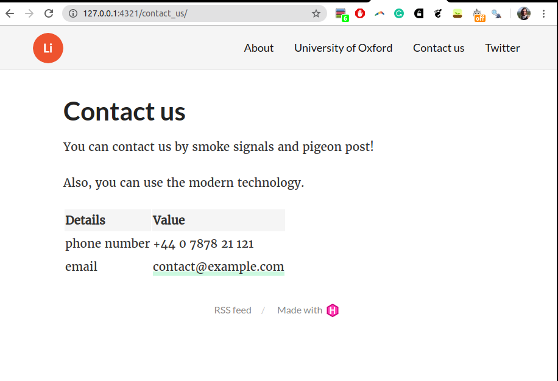
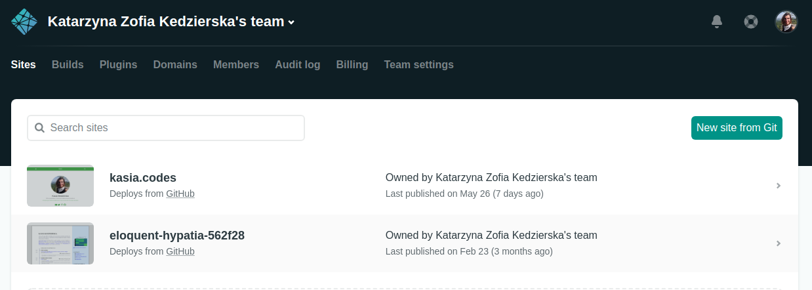
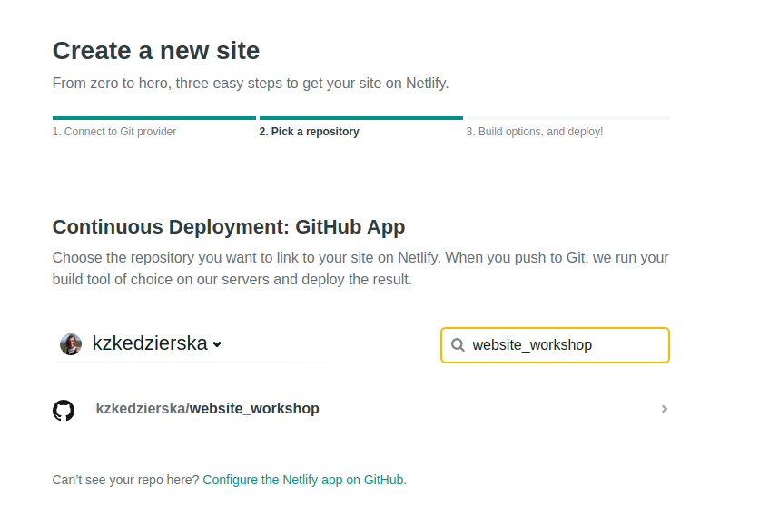
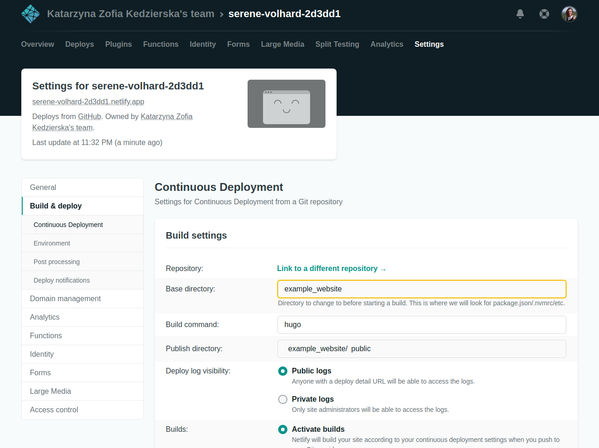
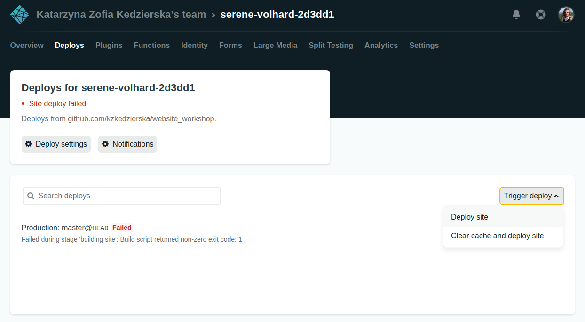

# Before we start

We need to check if we have all the necessary packages and software installed. I prepared a small script that will check and install necessary dependencies if it will not find them.

```{r}
source("scripts/install_pkgs_script.R")
```

```{r, class.source = 'fold-hide'}
### TODO: put into the script, some parts are redundant!
pkgs <- list(
  "knitr", # for nice formatting
  "blogdown" # the clue of the tutorial
)

# check if pkgs installed, and install after providing a warning if not
invisible(
  lapply(pkgs, function(pkg) {
    if (!library(pkg, character.only = TRUE, logical.return = TRUE)) {
      print(paste0("Warning: Installing the ", pkg, 
                   ". You have 5s to stop the process."))
      Sys.sleep(5)
      install.packages(pkg)
    }
    library(pkg, character.only = TRUE, logical.return = TRUE)
  })
)
```


```{r, echo = FALSE, message = FALSE, warning = FALSE}
knitr::opts_chunk$set(
  message = FALSE, 
  warning = FALSE, 
  eval = FALSE,
  fig.align = 'center', 
  cache = TRUE,
  class.source = 'fold-show')
```

# Important resources

There is a magnitude of freely available resources online. I list some of them below.  

* [blogdown](https://bookdown.org/yihui/blogdown/) - comprehensive book on the blogdown package and detailed instruction how to set up a website
* [Cool Tweetorial](https://twitter.com/dsquintana/status/1139846569623281664)
* [Setting up website on github](https://pages.github.com/)
* [Netlify - free hosting platform](https://www.netlify.com/)

# Simple example

Github offers free hosting of one personal website per account and project websites for each repository. You can read more how to set up a website you can find details [here](https://pages.github.com/).

In brief, to create a personal website set up a new repository names _username.github.io_. Github hosts the static websites created with [jekyll](https://jekyllrb.com/), but can host any static website, as long as there is an empty file `.nojekyll` in the repository. Then, github will not try to compile the website with jekyll and just host the content of the repository.

Example of a very simple website can be found here: [website](https://dchurch-lab.github.io/) and [repository](https://github.com/dchurch-lab/dchurch-lab.github.io). 

This website comprises of `html Rmarkdown notebooks` and some helper files as described in the directory structure below. 

```
± |master ✓| → tree -a 
.
├── dchurch-lab.github.io.Rproj
├── .git 
├── .gitignore # file with list of files to ignore while updating repository
├── index.html # compiled index website notebook
├── index.Rmd # the index website notebook
├── .nojekyll
├── notebooks # directory with other notebooks (subsequent websites)
│   └── plots
│       ├── jittered.html
│       └── jittered.Rmd
├── .Rhistory # not tracked file with Rcommands history 
└── .Rproj.user # not tracked user specific files


2 directories, 5 files
```

As you can see, all we need to set up a website with R is an html notebook and we're good. 

# Structured example

Simple example allows us to put on the website with very minimum content, such that we don't need to know anything about the website creation. However, it is not creating a continuous website. I.e. navigation and adding new content requires repeating the same action each time we generate new content. 

Thankfully, `R` comes with an amazing package `blogdown` that allows us to build a website without complex knowledge. 

In fact, we can create a website in less than 5 seconds after installing the package. 

```{r}
library(blogdown)
new_site(dir = "example_website/")
```

This will create an example website with `yihui/hugo-lithium` theme and some example content. There are many hugo themes available - you can browse them [here](https://themes.gohugo.io/) and install a given theme with `install_theme()` function which we will investigate a bit later with an example of an academic website.

```
○ → tree -L 2 -a 
.
├── config.toml
├── content
│   ├── about.md
│   └── post
├── index.Rmd
├── public
│   ├── 2015
│   ├── 2016
│   ├── about
│   ├── categories
│   ├── css
│   ├── favicon.ico
│   ├── fonts
│   ├── .gitkeep
│   ├── images
│   ├── index.html
│   ├── index.xml
│   ├── js
│   ├── post
│   ├── sitemap.xml
│   └── tags
├── static
│   ├── .gitkeep
│   └── post
└── themes
    └── hugo-lithium

17 directories, 9 files
```

When we want to compile the website after we already created it, we should navigate to the directory in which we created the website and execute the following:

```{r}
setwd("example_website/")
serve_site()
```


## Global settings

The most important file to set up global settings for the website is the `config.toml` file. We can find options regarding the website title, structure, main menu etc. Since, we are continuously serving the site, we can observe the changes we are making in real time. In order to be able to see all changes we will be inflicting, let's open the website in out browser. 

We can do that by clicking `Show in new window` button in RStudio, or navigating to the address provided by the earlier `blogdown::new_site()` or `blogdown::serve_site()` command (in my case `http://127.0.0.1:6576` but the ports might differ). 



#### Excercises

Now, let's start by opening `config.toml` and changing few things. 

1. Change the title to `"Our first website"`.

```{r, class.source = 'fold-hide'}
title = "Our first website"
```

2. Make the links simpler, i.e. `website_address/year/title`. 

```{r, class.source = 'fold-hide'}
[permalinks]
    post = "/:year/:slug/"
```

3. Add new menu element pointing to the University Website. 

```{r, class.source = 'fold-hide'}
[[menu.main]]
    name = "University of Oxford"
    url = "http://www.ox.ac.uk/"
```

If we would like control the order of the elements in the menu we need to add `weight = n` to all menu, where smaller `n` means higher order, and bigger `n` means lower position.

## Modifying content

The content can be found in the `content` directory. It stores the subpages as well as posts in the `post` subdirectory. 

As we see in the content of the directory there are already 3 posts here. Some of them are written in plain `markdown`, while there is one written in `R Markdown`. 

```
.
├── 2015-01-01-lorem-ipsum.md
├── 2015-07-23-r-rmarkdown.html
├── 2015-07-23-r-rmarkdown.Rmd
└── 2016-12-30-hello-markdown.md
```

### R Markdown Posts

Let's have a look at the `R Markdown` post. As we can see, it has same structure as R Markdown, offering us all the options normal notebook. It's ideal for sharing results of the analysis and blogging. 

We can create a new post with a dedicated `blogdown` function `new_post()`. 

```{r}
new_post(title = "Create new post!", ext = ".Rmd", 
         slug = "simpler-slug")
```
This will create `2020-06-03-create-new-post.Rmd` file, and open it in out R Studio. We can add the following chunk:

```{r}
hist(rnorm(1000), col = "darkgreen", 
     main = "Histogram of sample drawn from Gaussian Distribution - N(0, 1)", 
     xlab = "")
```

and when saving, we should get the following post.



Or, we can use `Addins -> New Post`.




### Markdown posts  

We can also create Markdown posts. There are some differences like the compilation of the equations and so on. The differences are described in the `A Plain Markdown Post` in our template. 

### Content linked to menu

When we want to create content linked to the menu we need to (1) create such content and (2) update the `config.toml` file.

Suppose we want to create Contact page and substitute Github link for it. First, we create a sub-page in the `content`. Similarly as with the posts, we can either create the `R Markdown` or simple `Markdown` pages. 

For example, I will create `contact_us.Rmd` file in the content directory. In the notebook, I will put some dummy contact info into a data frame and pretty print it with `knitr::kable()`. 

Next, I will edit the `config.toml` with the following info. 

```{r}
[[menu.main]]
    name = "Contact us"
    url = "/contact_us/"
    weight = 3
```

Note: url has to be the same as the file name without the extension!



# Deploying website with Netlify

This is an example of how to deploy the `example_website` we have been working on with [Netlify](https://www.netlify.com/). In this example, we will set the Continuous deployment after linking the website with the Github Repository. That means that every time we will push to our repository we will trigger the deployment automatically. 

First, we log into [Netlify](https://app.netlify.com/). We then choose `New site from Git`.



Then, after choosing Git hosting (in my case GitHub), we choose the repository. It might be the case, that we won't see the proper repository on the list and we have to go back to github to give Netlify permissions. In that case, we need to follow the instructions.

  

Then we accept, and navigate to the Settings. There, we change 3 options: `base directory`, `command` and `publish directory`. If we would create the new repository just with our website, our base directory would be empty, but since we created `example_website` inside the repository, we need to tell Netlify where to look for all the files.

  

Next, after saving the changes we need to trigger the deploy.



We could also save those details into a `netlify.toml` configuration file in the `example_website` directory and skip setting them up manually. To cover all the above we would specify the following:

```
[build]
  # Directory to change to before starting a build.
  # This is where we will look for package.json/.nvmrc/etc.
  base = "example_website/"

  # Directory (relative to root of your repo) that contains the deploy-ready
  # HTML files and assets generated by the build. If a base directory has
  # been specified, include it in the publish directory path.
  publish = "example_website/public"

  # Default build command.
  command = "hugo"
```

Now, the example website is currently deployed [here](https://serene-volhard-2d3dd1.netlify.app/).

# New website - new theme

```{r}
new_site("new_site", theme = "gcushen/hugo-academic", theme_example = TRUE)
```

```
.
├── assets
│   └── images
├── config
│   └── _default
├── config.toml
├── content
│   ├── authors
│   ├── courses
│   ├── home
│   ├── post
│   ├── privacy.md
│   ├── project
│   ├── publication
│   ├── slides
│   ├── talk
│   └── terms.md
├── index.Rmd
├── public
│   ├── 404.html
│   ├── admin
│   ├── author
│   ├── authors
│   ├── categories
│   ├── category
│   ├── courses
│   ├── css
│   ├── home
│   ├── images
│   ├── img
│   ├── index.html
│   ├── index.json
│   ├── index.webmanifest
│   ├── index.xml
│   ├── js
│   ├── post
│   ├── privacy
│   ├── project
│   ├── publication
│   ├── publication-type
│   ├── publication_types
│   ├── sitemap.xml
│   ├── slides
│   ├── tag
│   ├── tags
│   ├── talk
│   └── terms
├── resources
│   └── _gen
├── static
│   ├── admin
│   ├── img
│   └── post
└── themes
    └── hugo-academic

44 directories, 10 files
```

As we can see the directory is now more complicated with `content` including many different directories. This template, increases complexity, however it allows many sections to be compiled automatically. The Academic theme comes with built-in set up for courses, publications, projects and much more. We created the website with theme example, so we can read about each section while investigating the build website. 

The Academic Documentation is quite comprehensive and allows to grasp the structure and mechanics of the template when followed hands on (i.e. by trying out the suggested modifications).

# Inspiration

I list some websites that can serve as an inspiration. The list is far from comprehensive and only includes the website I know about. Hopefully though, the websites will come in handy.

__Websites with Academic template:__  

* [AI4Health](https://cwcyau.github.io/) - Chris Yau' group website  
* [Kaspar Martens website](https://kasparmartens.rbind.io/) - nice to see usage of GIFs in the website banner and posts  
* [My personal website](https://kasia.codes/) - simple example of the website, with CV linked (and automated in R with [this package](http://nickstrayer.me/datadrivencv/) as well!)  

__Other websites:__  

* [Simply Statistics](https://simplystatistics.org/about/) - Cool blog written by 3 biostatisticians  
* [Nick Stryer](http://nickstrayer.me/) impressive, but minimalistic website with single `R Markdown` file (and a bit of Java Script for the animation)  
* [NGSchool website](https://ngschool.eu/) - comprehensive website of the NGSchool Society and events it is organising.
* [Collection of the R generated websites](https://github.com/rbind)  